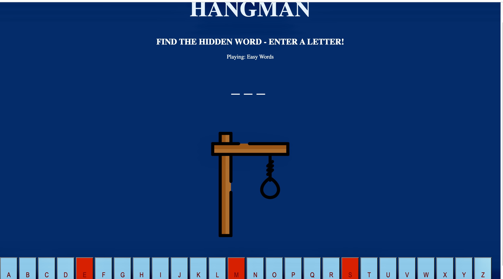

# Hangman-Game

## Project Description

Hangman-game is a word game in which the player is trying to guess a secret word.

## Getting Started

To play this game press any letter which you think it might be in our secret word. Player has 3 lives/chances to survive in this game.So player guesses incorrectly 3 times, he loses and if guesses the hidden word before 3 incorrect letters then player wins!

## List of the technologies used
 HTML
 / CSS /
 JAVASCRIPT 

 ##### HTML
 Game has several headers and paragraphs for main description and rule.And it has also buttons of letters in an alphabetical order also div element for my secret words to use in Javascript and images for the display

 ##### CSS
Game style exists of background color,sizing,decoration,width and height

##### Javascript
In Javascript there is a variable for random/secret words which player has to guess.And it follows with Math.random() static method for to display different words when the page uploads.After that we used some DOM elements to put random words text inside of our guess line and made it invisible.If player guessed any correct letter from random word/secret word then it will turn to green otherwise it will turn red.And lastly we have our function where we are changing the images based on players guess/word if its correct will display 'you win' image if its incorrect 'hanged man' image.

### Future Enhancements
Adding player attributes on a display such as players live,how many lives/chances has/left.
New levels and requirements for the new level

##### Link https://vee180.github.io/HangmanGame/

 

